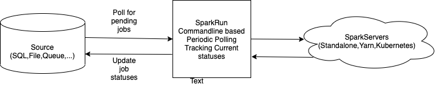

# SPARKRUN

### SparkRun an ongoing project with following objectives: 
##### 1. Exploring Cats, Typelevel eco-system (effect etc.) purely functional runtime systems.
##### 2. A utility project (Spark Job Execution)
##### 3. A comparative study with another Haskell based project (WIP) https://github.com/sumawa/hspark-run
  
* Spark Job Execution and Tracking Service
* launched via command line
* has two components (Runner for submitting jobs and Tracker for tracking jobs)

#### Concepts explored
See [Learnings from SparkRun](SPARKRUN_LEARN.md)

* functional programming (Effectful)
```
Cats 2.x (Effect - IO,ConcurrentEffect,ContextShift,Blocker,Timer etc.)
```
* FP libraries for boilerplate free common utilities:
```
pureConfig,Circe,http4s
```
* CI/CD: to explore dev approaches (BDD/TDD)
            BDD / TDD ScalaTest (or Cucumber maybe)
            Property based Testing (ScalaCheck)
            SonarQube

* Have more transparency in managing blocking calls via separate thread pools
* Using Blocker to manage blocking calls (DB/Third party APIs, etc)
* Streaming (fs2): Possibly for throttling multiple job executions
        
#### Pending
* Logging
* Documentation
* Enhance test coverage and testing styles.
	
### SparkRun Spark Execution and Tracking Service



### SparkRun Design Goals

1. Launch via command line
2. Configurable Multi Cluster Manager Yarn/Standalone/Kubernetes support
3. A "Job" is one unit of spark execution, representing a spark job.
5. There are two services "SparkRunner" and "Tracker"
4. Configurable poll based Multi Job Source (SQL DB, FileSystem, Message Queues, others ...)
5. SparkRunner service detects pending jobs and submits in parallel via Spark Runner (or executor service)
7. Tracker tracks multiple pending jobs 

### How to run
Project is WIP, this will change.
1. For deployment: Build assembly and execute sparkrun.sh
```
sbt  "project sa-spark-run" clean  assembly

sbt "project sparkrun" clean console
./sparkrun.sh
```
2. For experimental/exploring/debugging reasons, one can run sbt console and start with main class as entry point
```
SPARKRUN_ENV=dev SPARKRUN_HOME=$(pwd) SPARKRUN_TYPE=yarn  sbt "project sparkrun" clean console
      OR 
SPARKRUN_ENV=dev SPARKRUN_HOME=$(pwd) SPARKRUN_TYPE=standalone  sbt "project sparkrun" clean console

val srm = com.sa.sparkrun.SparkRunMain.run(List(java.util.UUID.randomUUID().toString))
srm.unsafeRunSync()
```

### Configuration Guide
1. Pending (link to separate document covering YARN / Standalone configuration elements in detail.)

### Upcoming enhancements

1. Kerberos support
2. Kubernetes, Rabbit MQ, Kafka support
3. Use dockerized containers for integration testing.
4. Integrate with JIRA
5. Exhaustive test coverage.


	
