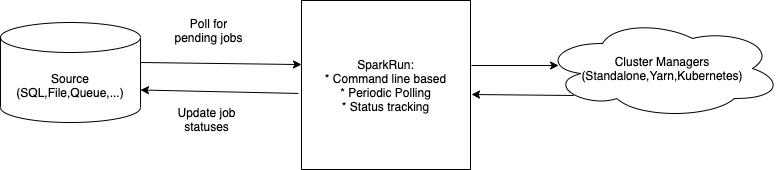

# SPARKRUN

### SparkRun is an ongoing project with two objectives: 
##### 1. for learning (FP/Effects) and 
##### 2. as a utility project (Spark Job Execution)
  
* Spark Job Execution Service and Tracking Service
* launched via command line
* has two components (Runner for submitting jobs and Tracker for tracking jobs)

#### Concepts explored
See [Learnings from SparkRun](SPARKRUN_LEARN.md)

* functional programming (Effectful)
```
Cats 2.x (Effect - IO,ConcurrentEffect,ContextShift,Blocker,Timer etc.)
```
* FP libraries for boilerplate free common utilities:
```
pureConfig,Circe,http4s
```
* CI/CD: to explore dev approaches (BDD/TDD)
            BDD / TDD ScalaTest (or Cucumber maybe)
            Property based Testing (ScalaCheck)
            SonarQube

* Have more transparency in managing blocking calls via separate thread pools
* Using Blocker to manage blocking calls (DB/Third party APIs, etc)
* Streaming (fs2): Possibly for throttling multiple job executions
        
### SparkRun Spark Execution and Tracking Service



### SparkRun Design Goals

1. Launch via command line
2. Configurable Multi Cluster Manager Yarn/Standalone/Kubernetes support
3. A "Job" is one unit of spark execution, representing a spark job.
5. There are two services "SparkRunner" and "Tracker"
4. Configurable poll based Multi Job Source (SQL DB, FileSystem, Message Queues, others ...)
5. SparkRunner service detects pending jobs and submits in parallel via Spark Runner (or executor service)
7. Tracker tracks multiple pending jobs 

### How to run
1. Pending

### Configuration Guide
1. Pending (link to separate document covering YARN / Standalone configuration elements in detail.)

### Upcoming enhancements

1. Kerberos support
2. Kubernetes, Rabbit MQ, Kafka support
3. Use dockerized containers for integration testing.
4. Integrate with JIRA
5. Exhaustive test coverage.


	
